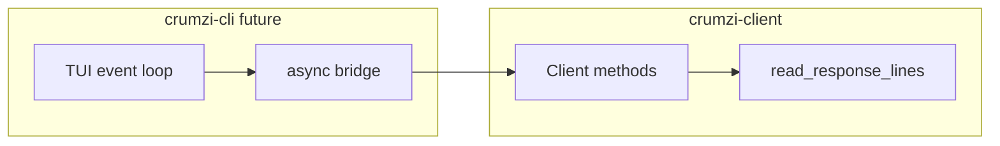

# crumzi-client gaps for CLI parity

This plan describes **missing functionality in [`crumzi-client`](../crumzi-client)** that [`src/app.rs`](src/app.rs) currently covers with the synchronous `mpd` crate. Implementing these commands in `crumzi-client` is a prerequisite for eventually dropping the `mpd` dependency. **Albumart / binary MPD responses are explicitly out of scope for now.**

## Context

| Usage | MPD command(s) | Present in crumzi-client? |
|-------|----------------|---------------------------|
| Queue list | `playlistinfo` | Yes (`playlistinfo`) |
| Play at index | `play <pos>` | Yes (`play_pos`) |
| Stored playlist names | `listplaylists` | No |
| Load playlist into queue | `load <name> [<range>]` | No |
| Editor: tracks in a stored playlist | `listplaylist <name>` | No |
| Resolve path by queue song id | `playlistid <id>` | No |
| Music root for on-disk cover paths | `config music_directory` | No |

Protocol I/O in `crumzi-client` today is text-only via [`proto/mod.rs`](../crumzi-client/src/proto/mod.rs) (`read_response_lines` until `OK`/`ACK`). Everything in this plan fits that model.

## Text commands and parsing

Add async methods on `Client<S>` (same style as [`playback.rs`](../crumzi-client/src/playback.rs) and [`queue.rs`](../crumzi-client/src/queue.rs)):

- **`listplaylists`**: parse repeated `playlist: <name>` lines into `Vec<Playlist>` or `Vec<String>`. Optional small type in `types/` (e.g. `Playlist { name: String }`) for parity with `mpd::Playlist`.
- **`listplaylist`**: send `listplaylist <name>`, parse with [`parse_song_list`](../crumzi-client/src/types/song.rs). Stored playlists use the same key/value song shape; `Pos`/`Id` may be absent—the parser should tolerate missing fields.
- **`load`**: `load <name>` with optional range `"start:end"` when callers need a slice (CLI today uses full load).
- **`playlistid`**: `playlistid <id>` → parse as a single song via the existing song parser.
- **`config`**: `config <name>` (e.g. `config music_directory`) → parse the `name: value` line MPD returns before `OK`. Expose `music_directory() -> Result<String>` as a thin wrapper.

Use [`Command`](../crumzi-client/src/proto/command.rs) for quoting/escaping.

## Module layout

- **`stored_playlists.rs`** (or `playlists.rs`): `listplaylists`, `listplaylist`, `load`.
- **`config.rs`** (or `admin.rs` if more config keys are expected): `config` / `music_directory`.

Re-export new types from [`lib.rs`](../crumzi-client/src/lib.rs) as needed.

## Tests

- Transcript/fixture tests (same style as [`proto/testdata`](../crumzi-client/src/proto/testdata)) for `listplaylists`, `listplaylist`, `playlistid`, and `config music_directory`.

## Out of scope (later)

- **`albumart`** and any binary-response handling in the protocol layer.
- **CLI migration**: swapping `mpd` for `crumzi-client` still needs an **async bridge** (e.g. `block_on` around client calls, a background task + channel, or an async TUI stack) and type mapping (`crumzi_client::Status` uses `song: Option<u32>` vs `mpd`’s `QueuePlace`; `current_track_path` in `app.rs` can use `status.song`, `songid`, `playlistid`, and queue `id` fields).
- **`toggle_pause`**: no new protocol—CLI can use `status().await` + `pause(...).await` once on `crumzi-client`.

## Cleanup note (crumzi-client)

A minimal [`status.rs`](../crumzi-client/src/status.rs) at the crate root may duplicate the `Status` name; keep public API aligned with [`types/status.rs`](../crumzi-client/src/types/status.rs) and remove or merge the stray file if it causes confusion.

## Verification

After implementing in `crumzi-client`: `cargo fmt`, `cargo clippy`, and `cargo test` from the workspace root (see repo [`AGENTS.md`](../AGENTS.md)).
